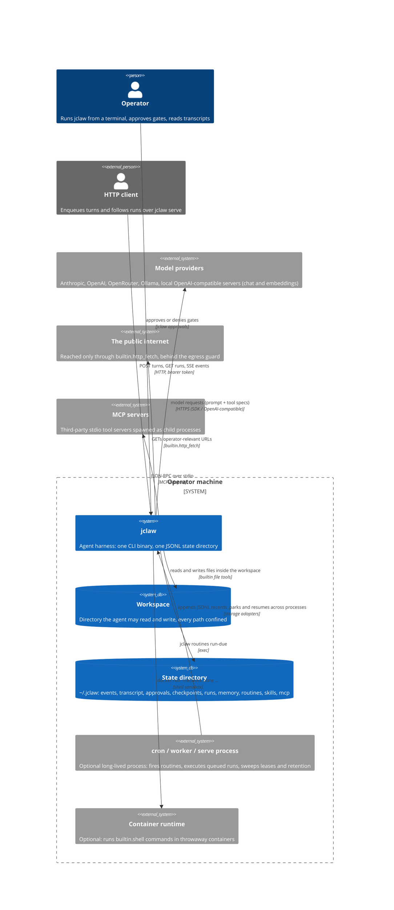
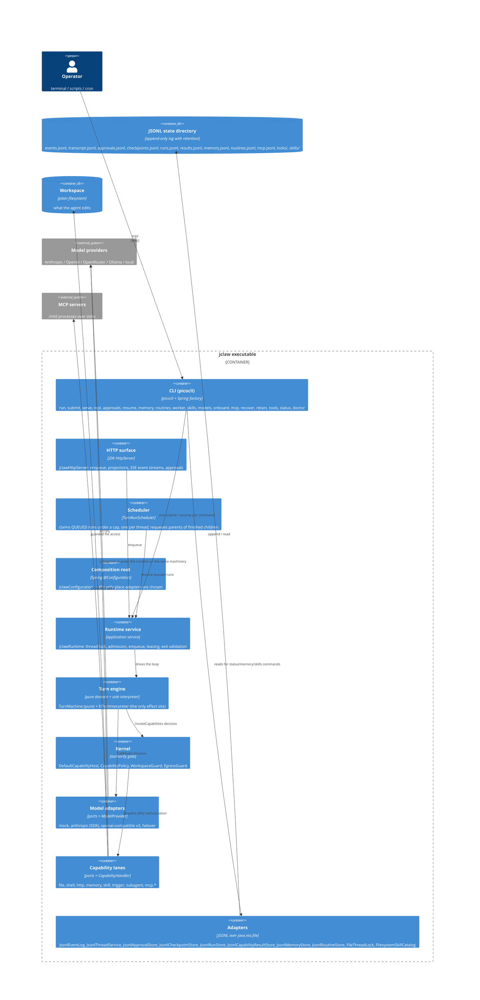
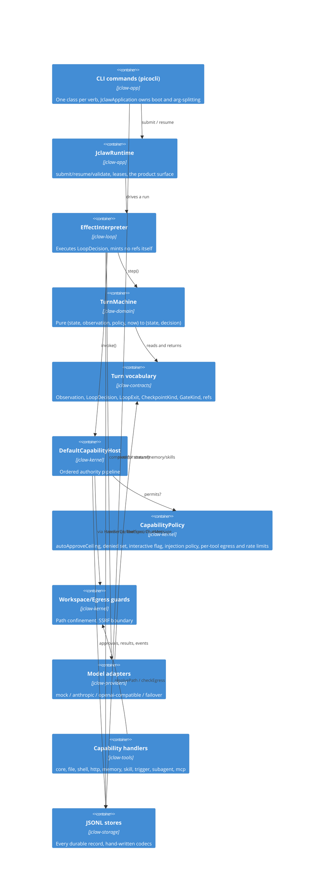
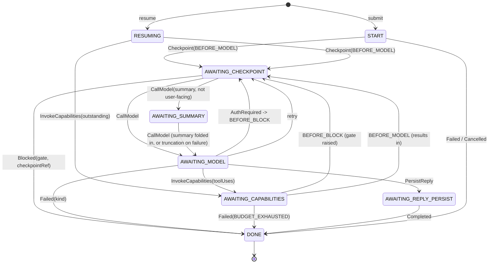
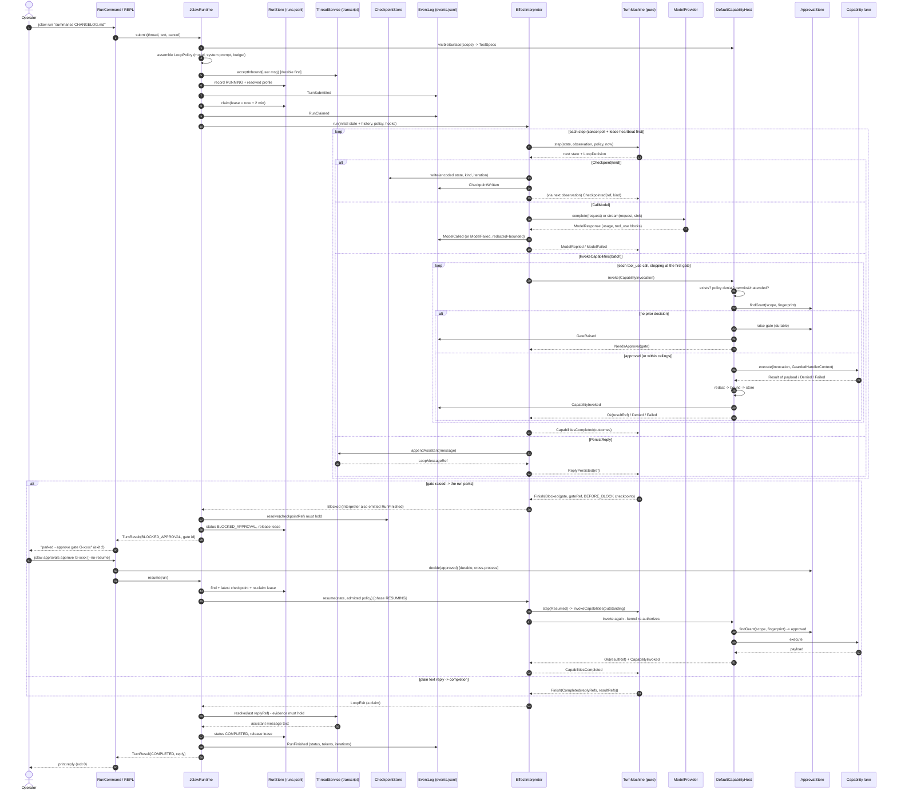

# jclaw — Architecture

This document describes the architecture of **jclaw** using the [C4 model](https://c4model.org) (Context → Container → Component → Code), then walks the complete lifecycle of a turn — from the moment a prompt is admitted to the moment a result is produced — and closes with a sequence diagram showing every step.

jclaw is a Java 21 / Spring Boot 4.1 reimplementation of the **architecture** of [IronClaw](https://github.com/nearai/ironclaw) (a ~1.4M-line Rust agent harness, internally "Reborn"). It is an architectural clone, not a port: the layering, the turn/run lifecycle, the untrusted-`LoopExit` trust model, and the `CapabilityHost` authority boundary are faithful; the feature surface is a fraction of IronClaw's (see [PARITY.md](PARITY.md)).

```
~20k lines of Java · 8 modules · 240 tests (0 failures, verified) · 13 machine-checked architecture rules
```

---

## 1. Architectural intent

jclaw is a **hexagonal architecture with a pure functional core**. Two rules shape everything else:

1. **Decisions are separated from effects.** The control flow of an agent — *what to call next, when to stop, what to remember* — lives in `TurnMachine`, a single pure function. Nothing in the decision path performs I/O. One component, `EffectInterpreter`, turns decisions into calls, and it is the only place in the system where an effect happens.
2. **Authority is a single gate.** A model's request to do something ("read that file", "run that command") is a *claim*. It becomes an effect only after passing one ordered pipeline — the `CapabilityHost` — whose order is itself a security property.

The design maps onto IronClaw's seven-layer ladder (contracts → domains → kernel → lanes → loop → product → app):

```
contracts   →  (jackson-annotations only)   ports, turn vocabulary, refs, LoopExit, Result,
                                             ThreadLock, EmbeddingProvider, content blocks
domain      →  contracts                    PURE: TurnMachine, Budget, Redaction, RrfFusion,
                                             MemoryRanking, VectorRanking, ContextCompaction,
                                             ContextSummary, InjectionHeuristics, RunScheduling,
                                             RateLimit, Retention, RunProjection, SandboxSpec,
                                             CronSpec, RoutineSchedule, PromptAssembly, LeaseRecovery
kernel      →  contracts, domain             CapabilityHost, CapabilityPolicy (denials, injection,
                                             per-tool egress and rate limits), Workspace/Egress guards
loop        →  contracts, domain, kernel     EffectInterpreter — the ONLY place an effect happens
providers   →  contracts                     mock, Anthropic (official SDK), OpenAI-compatible
                                             chat + embeddings (OpenAI / OpenRouter / Ollama / local),
                                             failover
tools       →  contracts, domain, kernel     file, shell (host or container), http, memory, skill,
                                             trigger, subagent, MCP client + capabilities
storage     →  contracts, domain, kernel     JSONL stores: events, transcript, approvals, checkpoints,
                                             runs, results, memory, routines, mcp; file thread locks
app         →  all of the above              Spring wiring, picocli CLI, JclawRuntime, scheduler,
                                             RoutineRunner, RecoveryService, RetentionService,
                                             McpRegistry, HTTP surface
```

The layer ladder is not a suggestion. `DependencyLawTest` (jclaw-app) enforces 13 rules with ArchUnit — including "the domain may not read a clock or use randomness", "the loop may not name an adapter", "only the anthropic package may import the Anthropic SDK", and "tool lanes may not read the process environment". The rules were verified to fire by planting deliberate violations, not just by passing.

### The five ideas worth preserving

1. **The loop is a pure function.** `TurnMachine.step(state, observation, policy, now)` returns `(nextState, decision)` and performs no I/O — no sockets, no clock reads, no ports. `EffectInterpreter` is the single component that executes decisions. The agent's entire control flow is testable with plain values and no mocks; replay is exact; and the complete set of effects an agent can cause is five constructors in `LoopDecision`.
2. **`LoopExit` is an untrusted claim.** A driver returns refs; `JclawRuntime.validate` re-resolves every ref against the store that minted it before any durable transition. A fabricated ref yields `DRIVER_PROTOCOL_VIOLATION`, not a completed turn.
3. **`CapabilityHost` is the single authority gate.** Order is a security property: existence → policy denial → approval (exact-invocation fingerprint) → dispatch → redact, bound, store, mint ref. Approvals are keyed by `scope + fingerprint`, so approving one `shell` command does not approve the next.
4. **Resume re-authorizes; it never assumes.** A parked run rehydrates its checkpoint and *re-dispatches* the gated capability, so the kernel asks the approval store again. Denying a gate and resuming produces a denial the model is told about, not an effect.
5. **Recovery never guesses in the permissive direction.** When a worker dies holding a lease, `LeaseRecovery` decides — purely — whether the run may be replayed. Only a checkpoint proven side-effect-free (`BEFORE_MODEL`, `BEFORE_BLOCK`, `BEFORE_CAPABILITY`) is requeued, and only after a full lease TTL of grace. Everything else, including an unknown checkpoint kind, becomes a terminal sanitized failure. Automatic retry of side-effecting work is never correct: a duplicated write cannot be un-written.

---

## 2. C4 Level 1 — System Context

The system in its environment: a human operator drives the agent over a CLI/REPL; the agent itself talks to model providers on its operator's behalf; tools reach the workspace and (guarded) the network; scheduled routines fire on their own.



Contextual properties worth stating:

- **The operator is not a bystander.** In the default `interactive` approval mode, anything that writes, reaches the network, or spawns a process requires an explicit human decision raised as an approval gate. The CLI's exit code 2 exists so a script can detect the park without parsing output.
- **The model controls only tool *requests*.** Model-generated tool calls are inputs to the kernel, never commands to it. A hallucinated or fabricated capability name is a denial (`capability_unknown`), not an error path.
- **Outbound data is minimized structurally.** Events carry ids, refs, enums, and counters — there is no record component for a prompt, a tool argument, or a host path. The system prompt carries the workspace *name*, never its absolute path. Tool output is redacted before it is stored, summarized, or logged.

---

## 3. C4 Level 2 — Containers

Everything ships as one deployable unit — an uber jar or a GraalVM native image (~80 MB, ~78 ms startup). Most commands are short-lived processes; `repl`, `worker`, and `serve` are the long-lived ones, and `serve` adds an HTTP ingress over the same runtime. That is exactly why every store is a durable append-only JSONL file rather than in-process state: a run parks in one process and resumes in another, and a turn enqueued over HTTP is executed by whichever worker claims it.



Container-level decisions:

- **No web framework, no database.** `spring-boot-starter` only; `spring-boot-starter-web` is absent, and `jclaw serve` uses the JDK's own `HttpServer` so the native image needs nothing extra. Persistence is JSONL under `jclaw.state-dir` (default `~/.jclaw`), swept by retention. `spring-jdbc`/H2 exist as dependencies but are unused — there is no SQL layer (see PARITY).
- **State survives the process on purpose.** Approvals and checkpoints are JSONL precisely so `run` can park and exit, a human can approve in a second process, and a third process can resume. The durable `run` record also stores the *resolved profile* (model, system prompt, scope), so a resume replays the run as admitted — not whatever config says now.
- **Child processes are second-class by design.** MCP servers are spawned per configured command; with `shell-backend=docker` each shell command is a throwaway container; subagents are *not* new processes but child runs on the same machinery (`RuntimeSubagentHost` → `JclawRuntime.submit`, or `enqueue` plus a process gate when asynchronous), so they inherit the same authority gate.
- **`failover` is a composite adapter**, not a fifth wire protocol: it wraps an ordered chain of whatever providers have credentials (Anthropic → OpenAI → OpenRouter → configured local → Ollama) and falls through on failure.

---

## 4. C4 Level 3 — Components

Inside the executable, the modules *are* the components. Arrows are compile-time dependencies; the whole diagram is a DAG with the contracts at its bottom.



### Component responsibilities

| Component | Module | Responsibility (one line) |
|---|---|---|
| `JclawApplication` | app | Boot; splits argv between Spring (`--jclaw.*`, `--spring.*`, `--logging.*`) and picocli; expands `--debug`/`--trace` into logging properties; rethrows `AbandonedRunException` untouched. |
| `JclawCommand` + `cli/*` | app | Picocli verbs: `run submit serve repl approvals resume memory routines worker skills models onboard mcp recover retain tools status doctor`. |
| `JclawRuntime` | app | The only surface a command touches. Takes the thread lock, admits or enqueues runs, claims leases, resolves the run profile, seeds the machine, **validates the exit claim** (reply and result refs), releases leases. |
| `TurnRunScheduler` | app | Claims `QUEUED` runs under a concurrency cap, one per thread, via the pure `RunScheduling`; requeues a parent waiting on a finished child. Driven by `worker` and `serve`. |
| `JclawHttpServer` / `ServeCommand` | app | The HTTP surface: enqueue, run projections, SSE event streams, transcript, approvals; bearer token; loopback by default. |
| `RoutineRunner` / `WorkerCommand` | app | Fire every due routine (`routines run-due`, `worker`, `serve`). |
| `RecoveryService` / `RecoverCommand` | app | Applies `LeaseRecovery.decideAll` to expired leases; `--dry-run` reports without acting. |
| `RetentionService` / `RetainCommand` | app | Applies `Retention` to results, events, and checkpoints with an atomic rewrite; never the transcript. |
| `Attachments` | app | Loads operator files into content blocks: images inline, UTF-8 text quoted, anything else refused. |
| `McpRegistry` / `RuntimeSubagentHost` | app | Lifecycle of external lanes: start enabled MCP servers and publish their tools; spawn subagent child runs, synchronously or as queued children behind a process gate. |
| `JclawConfiguration` | app | Composition root. Every port meets its adapter here and nowhere else: provider selection, `CapabilityPolicy` from `approval-mode`, guard wiring, credential redaction set. |
| `TurnMachine` | domain | The pure state machine. The whole transition table lives here; no I/O, no ports. |
| `Budget`, `Redaction`, `RrfFusion`, `MemoryRanking`, `VectorRanking`, `ContextCompaction`, `ContextSummary`, `InjectionHeuristics`, `RunScheduling`, `RateLimit`, `Retention`, `RunProjection`, `SandboxSpec`, `CronSpec`, `RoutineSchedule`, `PromptAssembly`, `LeaseRecovery` | domain | Total, deterministic helpers. The clock and the secrets are parameters, never reads. |
| `EffectInterpreter` | loop | Executes the five `LoopDecision` constructors; the one place an effect happens; emits the `JclawEvent` stream. |
| `DefaultCapabilityHost` | kernel | Existence → policy → rate limit → approval (or an open gate) → dispatch (with a per-tool egress context) → redact/bound/store/mint → injection scan. Every branch returns a `CapabilityOutcome`; nothing throws for an expected condition. |
| `CapabilityPolicy` | kernel | The host's posture: auto-approve ceiling, hard denials, whether a human is reachable, the injection policy, per-tool egress allowlists and rate limits. |
| `WorkspaceGuard` / `EgressGuard` | kernel | Path confinement (real-path containment, never string prefixes); URL denial (loopback, RFC1918, CGNAT, ULA, link-local, cloud metadata, non-http(s)). |
| `ModelProvider` + adapters | providers | `complete` / `stream` / `supports`. Streaming on every provider; images as native or data-URL blocks. The Anthropic SDK type appears only inside `providers/anthropic`; credentials resolve per request, never at construction. `EmbeddingProvider` has one OpenAI-compatible adapter. |
| `ToolNames` | contracts | Dotted ids → wire-safe function names, and decode-by-lookup against the tools actually sent. |
| `CapabilityHandler` lanes | tools | One handler per capability id; each declares effect + trust class; lanes receive only a `HandlerContext` (no method exists to obtain a secret). |
| `McpClient` / `McpCapabilityHandler` | tools | JSON-RPC 2.0 over stdio: initialize → `tools/list` → `tools/call`; every advertised tool registers as `mcp.<server>.<tool>`, `COMMUNITY` trust. |
| `Jsonl*` stores + codecs | storage | Append-only JSONL with fsync; hand-written codecs — no reflection (native-image safe), no accidental field disclosure. |

### The turn vocabulary (jclaw-contracts)

The sealed interfaces in `jclaw-contracts` are the entire protocol between machine, interpreter, and runtime:

- **In** — `Observation`: `Start`, `Resumed`, `ModelReplied`, `ModelFailed`, `AuthRequired`, `CapabilitiesCompleted`, `ReplyPersisted`, `Checkpointed`, `CancelRequested`. Everything non-deterministic arrives as one of these.
- **Out** — `LoopDecision`: `CallModel` (with a `userFacing` flag: a context summary is a model call that must not be streamed as the agent speaking), `InvokeCapabilities`, `PersistReply`, `Checkpoint`, `Finish`. Five constructors, and that is the complete set of effects an agent can cause.
- **Exit** — `LoopExit`: `Completed(replyRefs, resultRefs)`, `Blocked(gate, gateRef, checkpointRef)`, `Failed(kind, cause)`, `Cancelled`. A *claim*; validated before trusted.
- **Evidence** — `TurnRef`: `LoopMessageRef`, `LoopResultRef`, `LoopGateRef`, `LoopCheckpointStateRef`, `AcceptedMessageRef`. Host-minted handles; nothing accepts a raw string where a ref is expected.
- **Vocabulary enums** — `TurnStatus` (QUEUED, RUNNING, BLOCKED_APPROVAL, BLOCKED_AUTH, WAITING_PROCESS, COMPLETED, FAILED, CANCELLED); `FailureKind` (12 values, each with a `retryable`-style wire code such as `driver_protocol_violation`, `budget_exhausted`, `lease_expired`, `thread_busy`); `CheckpointKind` (BEFORE_MODEL, BEFORE_BLOCK, BEFORE_CAPABILITY — each `replaysNoSideEffect = true`; AFTER_CAPABILITY, AFTER_MODEL, UNKNOWN — fail closed); `GateKind` (APPROVAL, AUTH, PROCESS); `EffectClass` ordered PURE < READ_LOCAL < WRITE_LOCAL < NETWORK < PROCESS < DESTRUCTIVE; `TrustClass` (SYSTEM, FIRST_PARTY, VERIFIED, COMMUNITY, UNTRUSTED).
- **`Result<A, E>`** — a totality type used instead of exceptions for expected failures; it has no Jackson annotations at all, and no class in `contracts` imports Spring, HTTP, or `java.sql`.

---

## 5. C4 Level 4 — Code: the core classes

### 5.1 The turn state machine (`jclaw-domain/…/TurnMachine.java`)

`step(state, observation, policy, now)` is total: every (phase, observation) pair yields a `(state, decision)`, and a mismatched pair yields a protocol-violation finish rather than an exception. Every model call is preceded by a checkpoint, so an expired lease can always find a safe continuation point.



Transitions that carry weight:

- `RESUMING` re-dispatches **outstanding** tool calls first: the run parked because one of them needed approval, and the kernel must be asked again, not assumed. Only if none are outstanding does it continue to the next model call.
- `AWAITING_CHECKPOINT` routes on the kind of checkpoint just written: `BEFORE_MODEL` proceeds to `CallModel`, or first to a summary call in `AWAITING_SUMMARY` when the context policy would drop history and summarisation is on; `BEFORE_BLOCK` parks with the pending gate and its checkpoint ref. The kind says what the loop parked in front of, so no extra flag is needed. `BEFORE_CAPABILITY` / `AFTER_*` / `UNKNOWN` reaching the machine is a protocol violation.
- A tool round completes even when the budget is exhausted mid-flight — results must be recorded — and the run fails with `BUDGET_EXHAUSTED` on the way back.
- `onModelFailed` retries only when the provider marked the failure retryable, at most `policy.maxConsecutiveModelFailures()` (2) consecutive times, and only while budget remains; retries go through another checkpoint first.
- `AuthRequired` (a provider refused for want of credentials) parks the run behind a `BEFORE_BLOCK` checkpoint like an approval gate; nothing was appended, so resume goes straight back to the model call.
- `CancelRequested` is honoured from any phase. The interpreter only delivers it between effects, so stopping cannot orphan an in-flight capability.

### 5.2 The effect interpreter (`jclaw-loop/…/EffectInterpreter.java`)

The interpreter owns the driving loop: `for steps in 0..MAX_STEPS (1000)` — each iteration (1) polls the cancel flag, (2) renews the lease via `RunHooks.heartbeat` and bails with `LEASE_EXPIRED` if the lease was lost, (3) calls `TurnMachine.step`, (4) on `Finish` emits `RunFinished` and returns the exit, (5) otherwise executes the decision via the five-arm `interpret` switch. Each arm is one method, and between them the interpreter contains every side effect the system can perform:

| Decision | Effect | Returned Observation |
|---|---|---|
| `Checkpoint(kind)` | encode state (`LoopStateCodec`), `Checkpoints.write`, emit `CheckpointWritten` | `Checkpointed(ref, kind)` |
| `CallModel(req, userFacing)` | `ModelProvider.complete`/`stream` (streaming is presentation-only and only for user-facing calls — same `ModelResponse`), emit `ModelCalled` / `ModelFailed` (redacted, bounded to 200 chars); on an `AUTH` failure raise a durable auth gate and emit `GateRaised` | `ModelReplied` / `ModelFailed` / `AuthRequired` |
| `InvokeCapabilities(calls)` | dispatch each through `CapabilityHost.invoke`; **stop at the first `NeedsApproval`** so later effects in the batch never run | `CapabilitiesCompleted(outcomes)` |
| `PersistReply(message)` | `ThreadService.appendAssistant` → a `LoopMessageRef` minted by the store | `ReplyPersisted(ref)` |
| `Finish` | none — the driver returns it to `JclawRuntime.validate` | — |

The interpreter never mints a ref; every ref it hands the machine came from a store. So a `LoopExit` assembled from those refs is verifiable by construction — and still re-validated, because the trust model treats claims as claims.

### 5.3 The authority pipeline (`jclaw-kernel/…/DefaultCapabilityHost.java`)

`invoke(CapabilityInvocation)` runs a fixed order — cheapest and most absolute checks first, so a denied call never reaches code that could have a side effect:

1. **Existence.** An unknown id is `Denied("capability_unknown")` — a hallucinated tool name is a denial, never a dispatch. An invalid name (`CapabilityId.of` throws) is `capability_name_invalid`. Duplicate handler registration fails at startup, so a third-party tool can never shadow a built-in.
2. **Policy denial.** `CapabilityPolicy.isDenied` → `capability_denied_by_policy` (configured through `jclaw.denied-capabilities`; denied tools are also absent from the published surface).
3. **Rate limit.** A per-capability sliding window (`jclaw.tool-rate-limits`) is checked here, before a human is bothered with a gate, and counted at dispatch so a parked call spends no permit → `rate_limited`.
4. **Approval.** `permitsUnattended(descriptor)` = effect ≤ policy ceiling **and** the descriptor's own trust ceiling permits it — the stricter of the two always binds. Then look up `approvals.findGrant(scope, fingerprint)`; the fingerprint is a SHA-256 over the capability id plus sorted `k=v` arguments, so approvals are **per exact invocation** (approving one `shell` command does not approve the next). A prior denial is sticky (`approval_denied`). If the latest gate for the fingerprint is still open and unexpired, the run parks on that same gate again (a human never finds duplicates); if it has lapsed (`jclaw.approval-ttl`), it is asked afresh. If no decision exists: unattended → denied (`approval_required_but_unattended`); interactive → `approvals.raise` persists a gate, a `GateRaised` event is appended, and `NeedsApproval(gate, prompt)` comes back. The human-facing prompt is `id + redacted, bounded args`.
5. **Dispatch.** `handler.execute(invocation, context)` where the context is a `GuardedHandlerContext` exposing exactly `resolvePath`, `checkEgress`, `displayPath`, `maxOutputBytes`, wrapped in a `ToolScopedContext` when the capability has its own egress allowlist (applied after the host check, so it can only narrow). A lane that throws is treated as `Failed("handler_threw")` — its exception text can carry paths or secrets and must not escape. A lane that returns `Waiting` (a child run was started) raises a process gate keyed by the invocation and the run parks `WAITING_PROCESS`.
6. **Redact, bound, store, scan, mint.** Output is redacted (known credential values first, then key-shaped patterns), bounded to `maxOutputBytes` (64 KiB), stored via the durable `CapabilityResultStore` (a `LoopResultRef` comes back), then scanned by `InjectionHeuristics`: under the default `sanitize` policy the model-facing copy is fenced and its chat-template tokens defused, under `block` a HIGH finding withholds it as a denial, and either way an `InjectionDetected` event is appended. The stored payload is never altered. Every branch emits `CapabilityInvoked`.

`HandlerError` keeps `Denied` (a guard refused) distinct from `Failed` (the lane broke) and from `Waiting` (work continues elsewhere): collapsing the first two would hide blocked attacks among ordinary I/O errors, and the third is how a run parks on a process instead of blocking a thread.

### 5.4 The capability surface

Builtin ids are `builtin.<name>`, effect/trust as below (approval columns show what the three `jclaw.approval-mode` values do; all builtins are `FIRST_PARTY`, so operator policy is the only ceiling that binds them):

| Capability | Effect | `read-only` | `interactive` (default) | `trusted` |
|---|---|---|---|---|
| `builtin.echo`, `builtin.time`, `builtin.skill_list`, `builtin.skill_read` | PURE | auto | auto | auto |
| `builtin.read_file`, `builtin.list_dir`, `builtin.glob`, `builtin.grep`, `builtin.memory_search`, `builtin.trigger_list` | READ_LOCAL | auto | auto | auto |
| `builtin.write_file`, `builtin.memory_write`, `builtin.trigger_pause`, `builtin.trigger_remove` | WRITE_LOCAL | denied | gated | auto |
| `builtin.http_fetch` | NETWORK | denied | gated | auto |
| `builtin.shell`, `builtin.trigger_create`, `builtin.trigger_resume`, `builtin.spawn_subagent` | PROCESS | denied | gated | auto |
| `mcp.<server>.<tool>` | NETWORK, `COMMUNITY` trust | denied | gated | **gated** |

The last row is the point of the trust split: a `COMMUNITY` descriptor's own ceiling is `PURE`, and policy may only tighten — so **no configuration, including `trusted`, ever auto-approves an MCP tool**. `DESTRUCTIVE` (declared, no builtin uses it) would gate even in `trusted`.

Notable lane specifics: `builtin.shell` runs `/bin/sh -c` in the workspace root with a scrubbed environment (PATH, HOME, LANG, LC_ALL, TZ, TERM, SHELL, USER, TMPDIR survive; every API key is stripped), 30 s default timeout (1–300 clamped), 64 KiB output cap enforced *while reading*, and `destroyForcibly` on the whole tree at the deadline; with `jclaw.shell-backend=docker` the same lane runs each command as `docker run --rm --network none --memory … --cpus … --pids-limit … --read-only -v <workspace>:/workspace:rw -w /workspace <image> /bin/sh -c <command>` per the pure `SandboxSpec`, with the timeout, scrub, and output bound still applied to the container process. `builtin.http_fetch` is GET-only, applies `EgressGuard` before the socket opens, and re-validates every manual redirect hop (max 5; 20 s timeout; 128 KiB body cap; ≥400 responses fail with the body discarded as attacker-controlled). `builtin.read_file`/`grep` skip files over 256 KiB and non-UTF-8 files. Memories and routines are **project**-scoped (the workspace directory name) — cross-project leakage would be a prompt-injection vector.

### 5.5 Model adapters (`jclaw-providers`)

`ModelProvider` is four methods — `id()`, `supports(model)`, `complete(request)`, `stream(request, sink)` — returning `Result<ModelResponse, ProviderFailure>`. Three details are load-bearing:

- **Wire names.** Capability ids are dotted (`builtin.read_file`) because the namespace is what stops a third-party tool impersonating a built-in, but both the OpenAI-compatible and Anthropic function-name schemas require `^[a-zA-Z0-9_-]{1,64}$`. `ToolNames` encodes the dot to a single underscore on the way out and decodes by **lookup against the tools actually sent** on the way back, never by parsing — `x.a_b` and `x.a.b` encode identically, so an ambiguous mapping is refused rather than guessed. A dotted name in the request is a 400 for the whole call, and double-underscore names measurably confuse tool-tuned local models.
- **Per-request credentials.** The Anthropic adapter reads `ANTHROPIC_API_KEY` at call time, not construction time. A provider bean that threw while wiring would take the whole context down — including `doctor`, the one command whose job is to report the missing key. A missing key surfaces as `AUTH (…)` in the event log and a failed `doctor` check.
- **HTTP/1.1 pinned** on the OpenAI-compatible adapter: Java's `HttpClient` would send an h2c upgrade on plain-HTTP URLs, and llhttp-based servers (uvicorn's httptools mode — i.e. vLLM) pause body parsing on any Upgrade header. `doesNotAttemptH2cUpgrade` asserts the headers are absent and was verified to fail when the pin is removed.

The `mock` provider (default, no key) can be scripted (`jclaw.mock-script=text:…`/`tool:<cap>:<k=v>`) which is how the whole CLI — including tool calls and the approval flow — is exercised without a network. 8. **Checkpoint, always before the model.** The first decision out of `START` (and out of `RESUMING` when nothing is outstanding) is `Checkpoint(BEFORE_MODEL)`: the interpreter encodes the whole loop state (`JsonLoopStateCodec`, schema v1), writes it to `checkpoints.jsonl`, emits `CheckpointWritten`, and hands back `Checkpointed(ref)`. The machine reads the kind and immediately decides `CallModel`. Because every model call has one, a crash at any point has a checkpoint that can be proven replay-safe or not — recovery never has to guess.

---

## 6. The turn lifecycle — from prompt to result

This is the complete, ordered story of one `jclaw run "…"` (and, through `submit`/`resume`, of every other product surface). File paths are clickable.

### Phase A — Admission (durable before anything runs)

1. **Parse and inject.** `JclawApplication.main` expands `--debug`/`--trace` into `--logging.*` properties, boots Spring, and hands picocli the argv minus every `--jclaw.*`/`--spring.*`/`--logging.*` argument (both frameworks see the same argv; without the split, `jclaw run --jclaw.provider=anthropic …` would make picocli choke on an unknown option). `RunCommand` (`jclaw-app/src/main/java/io/jclaw/app/cli/RunCommand.java`) registers a shutdown hook that sets a `cancel` flag, then calls `JclawRuntime.submit(thread, text, cancel)`.
2. **Resolve the run profile.** `JclawRuntime.submit` (`jclaw-app/src/main/java/io/jclaw/app/runtime/JclawRuntime.java`) builds the scope — `TurnScope.local(projectName, thread)`, project = the workspace directory name — then assembles the `LoopPolicy`: model from config, the system prompt (operator base + a `## Workspace` section naming the directory, never its absolute path, + a `## Available skills` block of one-line skill summaries per `PromptAssembly`), the visible capability surface (`CapabilityHost.visibleSurface`, filtered by policy denial, mapped to `ToolSpec`s), max output tokens 8192, max consecutive model failures 2. The profile is assembled **once at admission** and recorded with the run, so a resume tomorrow replays the prompt the run was admitted under, not today's config.
3. **Lock the thread, then persist the inbound message.** (Through `submit` or `enqueue`; an enqueued run skips the rest of this phase and is picked up later by the scheduler, which resumes it under the same lock.) `threadLocks.tryAcquire(scope)` takes an OS file lock for the canonical thread (`FileThreadLock`, `<state-dir>/locks/<hash>.lock`); if another run holds it the submission is refused with `THREAD_BUSY` and nothing below happens. Then `threads.acceptInbound(thread, user)` appends to the durable transcript *before any run exists*, so a crash cannot lose what the user asked for. (The returned `AcceptedMessageRef` is a ref already — inbound messages are facts, not claims.)
4. **Record and claim the run.** A `RunRecord` with the resolved profile is appended to `runs.jsonl`; a `TurnSubmitted` event is appended to `events.jsonl`; then `runs.claim(run, workerId, now + 2 min)` writes a lease. A fresh run id that is somehow already claimed fails **closed** (`INTERNAL`). `RunClaimed` is emitted. `workerId` is random per process on purpose — a restarted worker must not inherit a claim its predecessor died holding.
5. **Seed the machine.** The thread's transcript (which includes the message just accepted, attachments and all) becomes `LoopExecutionState.start(messages, budget)`: whole when summarisation is on (the machine summarises what its window drops before the first call), or compacted by the pure `ContextCompaction` under the run's `ContextPolicy` when it is off (message cap + estimated token budget; cuts only at a user or assistant boundary; folds a "N earlier messages omitted" notice into the first kept user message). A queued run is seeded with the conversation as of its own submission, its own message last. The state carries with a `Budget` of `maxTokens` / `maxIterations` / a fixed 10-minute wall-clock cap, and control passes to `EffectInterpreter.run` with per-run hooks: the lease heartbeat and, for `--stream`/REPL streaming, a sink for prose deltas.

### Phase B — The drive loop (repeats; it is a loop, not a pipeline)

6. **Every iteration, before deciding anything:** poll the cancel flag; renew the lease (`heartbeat` returning `false` — lost to a reconciler or another worker — ends the run immediately with `Failed(LEASE_EXPIRED)`, because two workers on one run is exactly what leases prevent).
7. **Decide.** `TurnMachine.step(state, observation, policy, now)` — pure: no I/O, no clock reads, no ports. The machine checks the budget, routes on `(phase, observation)`, and returns the next state plus one of five `LoopDecision`s. A mismatched pair terminates with `DRIVER_PROTOCOL_VIOLATION`. After 1000 steps without convergence (a defect, not a user condition) the interpreter returns `Failed(INTERNAL)`.
8. **Checkpoint, always before the model.** The first decision out of `START` (and out of `RESUMING` when nothing is outstanding) is `Checkpoint(BEFORE_MODEL)`: the interpreter encodes the whole loop state (`JsonLoopStateCodec`, schema v1), writes it to `checkpoints.jsonl`, emits `CheckpointWritten`, and hands back `Checkpointed(ref)`. The machine reads the kind and immediately decides `CallModel`. Because every model call has one, a crash at any point has a checkpoint that can be proven replay-safe or not — recovery never has to guess.

9. **Call the model.** If the context policy would drop history and summarisation is on, a non-user-facing summary call goes first and its answer replaces the dropped span in the state. Then `provider.complete(request)` — or `stream` when a sink is present and the call is user-facing; streaming is presentation-only and both paths yield the same `ModelResponse`. On success the interpreter appends `ModelCalled` (provider, model, usage, latency) and returns `ModelReplied`; on an `AUTH` failure it raises a durable auth gate and returns `AuthRequired`, which parks the run `BLOCKED_AUTH`; on any other failure it appends `ModelFailed` with the provider's detail **redacted then bounded to 200 chars** (the detail explains a rejection, but it originates outside the host) and returns `ModelFailed` mapped onto the loop's `FailureKind` (`EGRESS_DENIED` → `POLICY_DENIED`, rate-limit/upstream/transport → `PROVIDER_ERROR`, unknown model → `PROVIDER_UNAVAILABLE`, invalid request → `INVALID_REQUEST`).
10. **Charge and branch.** Back in the machine: usage is charged to the budget, the success/failure counter updated, the assistant message appended to the state. If the reply contains `tool_use` blocks → `InvokeCapabilities`. A plain text reply → `PersistReply` (a plain reply ends the turn — but only once the host has minted a ref for it). A retryable failure → retry (after another checkpoint) while ≤2 consecutive and budget remains; otherwise `Failed`.
11. **Dispatch each capability through the kernel** (§5.3). The interpreter calls `CapabilityHost.invoke` sequentially and **stops at the first `NeedsApproval`**: running further effects after deciding to block would be exactly the duplicated work checkpointing exists to prevent. Results are stored redacted and bounded; each `Ok` carries a `LoopResultRef`.
12. **Fold the outcomes.** The machine builds one `tool_result` message from all outcomes (denied and failed calls become model-visible error text — the model is told, and may change plan), records the `Ok` refs, advances the iteration, and checks the budget: exhausted → `Failed(BUDGET_EXHAUSTED)` with the results already durable; otherwise back to step 8 (another `BEFORE_MODEL` checkpoint, then the model sees the tool results and decides again).

### Phase C — Parking (when the kernel raises a gate)

13. **A gate parks the run.** Any `NeedsApproval` in a batch — an approval gate, or a process gate because a lane started a child run — sets a pending block and decides `Checkpoint(BEFORE_BLOCK)`; the checkpoint records *partial progress* — the tool calls already dispatched have their results in the state; the ones after the gate were never dispatched. On `Checkpointed(BEFORE_BLOCK)` the machine finishes with `Blocked(gate, gateRef, checkpointRef)`. `JclawRuntime.validate` (§14) requires the checkpoint ref to resolve — parking a run that could not be resumed without repeating effects would strand the user — and records `BLOCKED_APPROVAL`. `RunCommand` prints the gate id and exits **2**; the REPL prints the exact `jclaw approvals approve <gate>` command.
14. **A human decides, in a separate process.** `jclaw approvals approve <gate>` records the decision in `approvals.jsonl` (the gate file is durable precisely so the decision can outlive the process that raised it) and, by default, resumes immediately; `--no-resume` defers. `deny` records the denial and resumes only with `--resume`. A `GateResolved` event is appended.

### Phase D — Resume (re-authorize, never assume)

15. **Rehydrate.** `JclawRuntime.resume` takes the thread lock, reads the run record (parked or queued), decodes the latest checkpoint — an undecodable checkpoint fails rather than being guessed at; a queued run without one starts fresh from the transcript — replays the **admitted** profile (not current config), flips to `RUNNING`, and re-claims the lease. A fresh claim that fails means another worker is resuming; this one stands down.
16. **Re-dispatch.** The machine starts in `RESUMING`. Outstanding tool calls — exactly the ones that caused the park, including any that were queued behind the gated call — are sent through the kernel **again**. The kernel re-consults the approval store for the exact invocation fingerprint: approved → dispatch; denied → a `Denied("approval_denied")` result the model sees and can plan around; still undecided → the run parks again. From there it is phase B again.

### Phase E — Completion (evidence, then trust)

17. **Persist the final reply.** On a tool-free reply the interpreter persists it via `ThreadService.appendAssistant`, which mints the `LoopMessageRef`; the machine attaches the ref and finishes with `Completed(assistantRefs, resultRefs)`.
18. **Validate the claim.** `JclawRuntime.validate` does not trust the exit. `Completed` requires the **last** reply ref to resolve against the transcript and every result ref to resolve against the durable result store (else `DRIVER_PROTOCOL_VIOLATION`); `Blocked` requires the checkpoint ref to resolve; `Failed`/`Cancelled` need no evidence. The resolved status is recorded (`recordStatus` tolerates a rejected transition rather than discarding a waiting reply) and the lease is **released explicitly** — a finished run should not sit in the reconciler's candidate set for two minutes. The `RunFinished` event carries spent tokens and iterations.
19. **Report.** The CLI prints the resolved reply text (or, on failure, `status (category): detail`), and exits **0** on `COMPLETED`, **1** on `FAILED`/`CANCELLED`, **2** on a park (`BLOCKED_APPROVAL`, `BLOCKED_AUTH`, `WAITING_PROCESS`). The distinct park code exists so a script never confuses "waiting for a human" with "crashed".

### Lifecycle variants

- **Model failure:** one failed call is an observation, not an end. Retryable → one retry per failure, ≤2 consecutive, each retry checkpointed. Non-retryable (or the third in a row, or no budget) → `Failed(category, redactedDetail)`.
- **Budget exhaustion:** checked at `START`/`RESUMING` and after every tool round; `BUDGET_EXHAUSTED` with the reason. Iteration and token ceilings come from `jclaw.max-iterations` / `jclaw.max-tokens`; the 10-minute wall-clock cap is fixed in `JclawRuntime.budget()`.
- **Cancellation:** the shutdown hook or Ctrl-C in the REPL flips an `AtomicBoolean`; the loop observes it between effects only and finishes `Cancelled` — it never interrupts an in-flight capability, so no effect is left unaccounted for.
- **Worker crash (`recover`):** `LeaseRecovery.decide` — pure — classifies each expired-lease run: already terminal or no lease or lease valid → leave; parked on a gate → leave (it waits on a human, not a worker); inside the one-TTL grace window → leave (a slow worker may still be alive; requeueing now would duplicate its work); past grace with the latest checkpoint `replaysNoSideEffect` → **requeue**; anything else, *including an unknown checkpoint kind* → terminal `Failed(LEASE_EXPIRED, "checkpoint … may have side effects")` for the user to resubmit. Automatic retry of side-effecting work is never correct.
- **Subagents:** `builtin.spawn_subagent` starts a child run on the same `JclawRuntime` — same machine, same interpreter, same kernel — under a child thread id carrying a depth marker derived from the parent's id (max depth 3); only its conclusion travels back, never its transcript. Synchronously the child runs inside the parent's tool call; with `jclaw.subagents-async` it is enqueued, the parent parks `WAITING_PROCESS` on a process gate, the scheduler requeues the parent when the child finishes, and the re-dispatched call returns the conclusion.
- **Queued turns:** `submit` and the HTTP ingress make the inbound message and a `QUEUED` record durable and return; `TurnRunScheduler` (in `worker` or `serve`) picks runs oldest-first under a concurrency cap, one per thread, and drives them through `resume`.

---

## 7. Sequence diagram — one turn, every step

The diagram below follows a run that calls one tool, parks on its approval gate, is approved by a human in a second process, resumes, and completes. `run --stream` only adds delta events to the provider call; every other arrow is identical.



Failure paths compress to the same frame: a non-retryable or repeated `ModelFailed` becomes `Finish(Failed(kind))`; `validate` maps it to `TurnStatus.FAILED` and the CLI exits 1. A lost lease becomes `Failed(LEASE_EXPIRED)` without any validation needed. Cancellation is `Finish(Cancelled)` from any phase.

---

## 8. Cross-cutting concerns

### Durability and the state directory

Every store is an append-only JSONL file under `jclaw.state-dir` with fsync on append; retention (`jclaw retain`, or hourly from `worker`/`serve`) rewrites results, events, and checkpoints atomically to drop rows of finished runs past their age, and never touches the transcript. The layout is the audit trail:

| File | Owner | Holds |
|---|---|---|
| `events.jsonl` | `JsonlEventLog` | `TurnSubmitted`, `RunClaimed`, `ModelCalled`, `ModelFailed`, `CapabilityInvoked`, `InjectionDetected`, `GateRaised`, `GateResolved`, `CheckpointWritten`, `RunFinished` — ids, enums, counters only. `RunProjection` folds them into a per-run read model |
| `transcript.jsonl` | `JsonlThreadService` | every inbound and assistant message, per thread, attachments included |
| `runs.jsonl` | `JsonlRunStore` | run records with resolved profile, status transitions, lease |
| `checkpoints.jsonl` | `JsonlCheckpointStore` | encoded loop state per checkpoint, with kind, iteration, schema version |
| `approvals.jsonl` | `JsonlApprovalStore` | approval, auth, and process gates with expiry, and their decisions, keyed by scope + fingerprint |
| `results.jsonl` | `JsonlCapabilityResultStore` | full capability payloads (redacted, bounded) behind result refs |
| `memory.jsonl` | `JsonlMemoryStore` | project-scoped memories with tags and, when configured, embeddings |
| `locks/<hash>.lock` | `FileThreadLock` | one OS file lock per canonical thread; empty files, the lock is the kernel's |
| `routines.jsonl` | `JsonlRoutineStore` | cron routines, `lastFiredAt` |
| `mcp.jsonl` | `JsonlMcpServerStore` | MCP server definitions (argv, env, enabled) |
| `skills/<id>/SKILL.md` | `FilesystemSkillCatalog` | installed skills |

Codecs are hand-written (`EventCodec`, `MessageCodec`, `JsonLoopStateCodec`): no reflection for the native image, no accidental field disclosure, and a wire format decoupled from the records.

### Redaction

`Redaction.redact(text, knownSecrets)` runs in two passes — exact known credential values (read from the environment at call time) first, then key-shaped patterns (Anthropic/OpenAI keys, GitHub tokens, Slack tokens, AWS access keys, bearer headers, `key=value` assignments for secret-like names, JWTs, PEM private keys). `Redaction.bound` truncates *after* redaction so a secret straddling the cut cannot survive as a fragment. The same path serves capability output, human-facing approval prompts, provider failure detail, and every TRACE log line.

### Observability

The event log is the record; logs narrate. `--debug` narrates each pipeline step (admission, every `phase + observation -> decision`, checkpoint writes, the kernel's authority path, provider calls with timings and token usage, exit-claim validation, lease release). `--trace` adds redacted, bounded payloads. `TurnMachine` itself never logs — the interpreter logs its decisions — so the domain stays pure.

### Scheduling and recovery

Nothing inside jclaw is a daemon by default. Routines are fired by `jclaw routines run-due` (from system cron), `jclaw worker` (a poll loop, default every 30 s, minimum 5 s), or `jclaw serve`; all call the same `RoutineRunner`, which records the firing *before* submitting the turn so a crash cannot re-fire in a tight loop, and which fires each overdue routine once rather than once per missed slot. Each tick sweeps expired leases (`RecoveryService`) before claiming new work, then drains the run queue through `TurnRunScheduler` under the concurrency cap; retention runs hourly. The decision of which queued runs to start is the pure `RunScheduling`; execution still passes through the thread lock and the lease, so a queued run refused for contention simply waits a pass.

### Native image

The `native` Maven profile in `jclaw-app` builds a GraalVM binary (~80 MB, ~78 ms startup vs ~1.2 s for the jar). Two pieces of metadata make it work: `picocli-codegen` generates reflection config for every `@Command`, and the Anthropic SDK's Jackson metadata was *captured* by the GraalVM tracing agent (`META-INF/native-image/io.jclaw/anthropic-sdk/`) and must be regenerated after any SDK upgrade — and, if image attachments are to be sent through the Anthropic adapter from the native binary, captured with a request that carries an image, since the image block types were not exercised by the original capture. Subprocess spawning (MCP servers, `builtin.shell`, the docker sandbox) and the JDK HTTP server are verified to work in the native binary.

---

## 9. Design decisions worth knowing before changing things

- **Why JSONL and not a database.** A CLI parks in one process and resumes in another; JSONL gives that with zero setup and a human-readable audit trail. At hosted scale it would not do (see PARITY.md).
- **Why the system prompt is frozen at admission.** The model's instructions must not change underneath a conversation midway through; a resume replays the admitted prompt even if a skill was installed since.
- **Why compaction is a view, and summarisation an effect.** `TurnMachine.buildRequest` runs `ContextCompaction` on the state's full message list before every model call, so the checkpointed state and the transcript stay complete while the request is bounded; the policy is idempotent, so seeding and per-call compaction compose. Summarising the dropped span needs a model call, so it is a decision the machine makes (`CallModel` with `userFacing=false`) and the interpreter performs, never something the pure policy does itself; its answer re-enters the state as the notice, and its failure degrades to truncation.
- **Why the HTTP surface enqueues instead of executing.** A request thread that ran a turn would hold the connection for minutes and die with it; enqueuing makes the inbound durable at once and lets the scheduler execute under the same locks and leases as everything else. Progress is a projection of the same log a terminal user reads with `status`.
- **Why the sandbox is a value.** `SandboxSpec` renders the whole `docker run` argument vector as a pure function, so every isolation flag is pinned by a test and a change to what a command may reach is a reviewable diff.
- **Why approvals are per fingerprint, not per capability.** "Approve `shell`" would be a standing grant to run anything. A fingerprint over id plus sorted arguments approves one command.
- **Why provider base URLs bypass the egress guard.** The guard stops *model-controlled* URLs from reaching internal addresses; a base URL is operator configuration, and `localhost:11434` for Ollama is the intended use.
- **Why per-request credentials.** A provider bean throwing during wiring would take down `doctor`, the one command whose job is to explain the missing key.
- **Why streaming cannot change behaviour.** Both provider paths produce the same `ModelResponse`; the machine never learns which was used, so a streamed transcript equals a buffered one.
